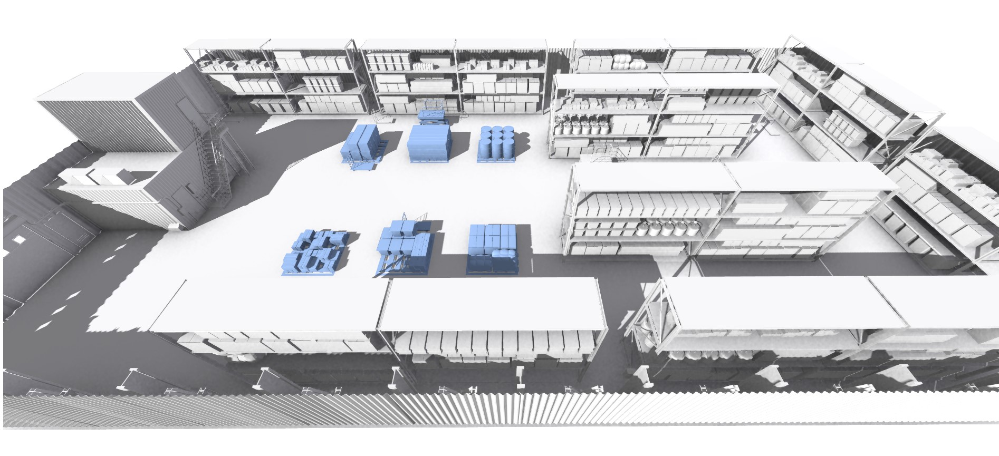

# React-Three-Fiber Demo

using PCF-Softshadows and [N8AO Ambient Occlusion](https://github.com/N8python/n8ao)



## Install and run

run in Linux oder WSL:

1. Clone the repository:
   ```
   git clone https://github.com/LaserBorg/react-three-test.git
   cd react-three-test
   ```

2. Install the dependencies:
   ```
   npm install
   ```

3. run
   ```
   npm start
   ```

This will open the application in your default web browser at `http://localhost:3000`.
